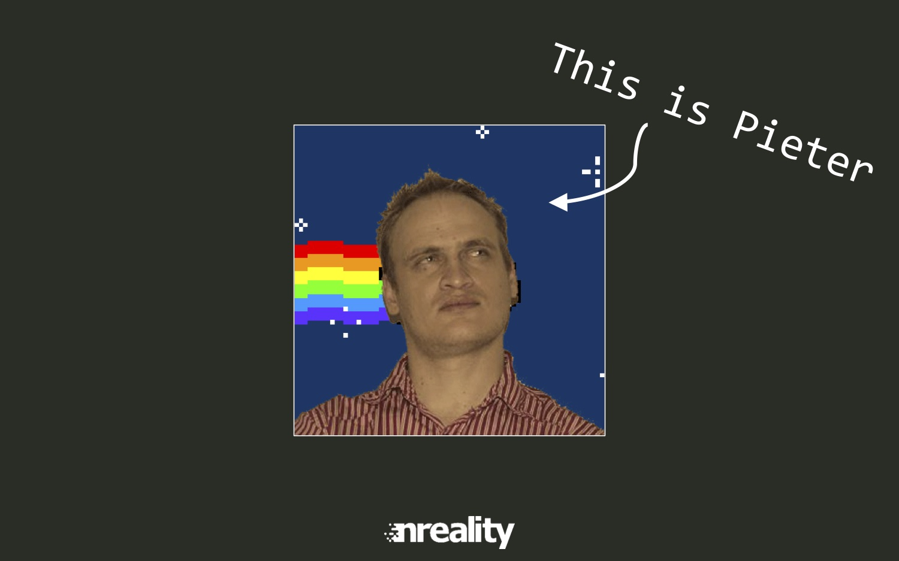

We turn 50!

READMORE

_Frolicking (verb) - to gambol merrily; to play in a frisky, light-spirited manner; romp. From the Dutch, vrolijk._

Kenneth, Kevin & Len are joined by former panelists Steven McDonald and Pieter Germishuys for a look back at the origin of the podcast, the past 50 episodes and the future of our founding team.

From the humble beginnings of just "recording our frequent Skype calls", Steven & Pieter recount the early days of the podcast and the pain of recording Skype calls. Each panelist shared their favourite shows, and Steven asked which shows were the most challenging for all of us.

Steven will be moving to New Zealand in the near future with his family, and we unpacked a bit of what that meant for him. What was the allure, what is he looking forward to and what will he miss? Pieter and his family are off to the UK as well, and we find out about their plans to travel from there.

Thanks to Steven and Pieter for starting all of us on this adventure! And thanks for the valuable feedback and continued support!

Favorite shows:

* Steven - [Spine Model](/29)
* Pieter - [Angular 2](/45) and [Dependency Injection](/4)
* Len - [Clojure](/27) and [Datomic](/48)
* Kevin - [React/Redux with Taariq](/47) and [E\_POOR\_DEVELOPMENT\_PRACTICES](/49)
* Kenneth - [Civic Hacking](/26) and [Data Visualization](/37)

Some resources mentioned throughout the show:

* Martin Cronje's JSinSA 2014 Presentation, featuring Nyan Pieter - https://speakerdeck.com/martincronje/jsinsa-2014-using-node-dot-js-for-a-real-app-the-good-the-bad-and-the-ugly
* Mumble - https://mumble.info
* Piezo Audio Recorder - https://rogueamoeba.com/piezo/

And finally, nyan Pieter

